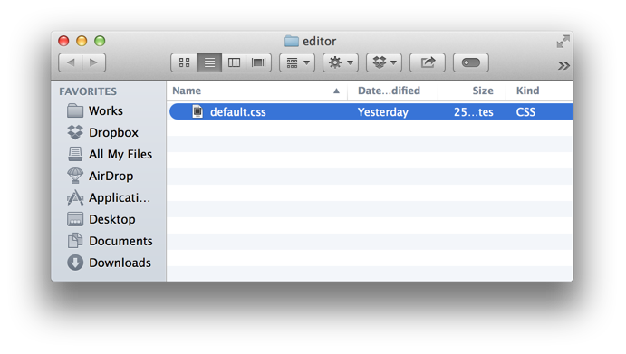

## 하루패드 스타일 사용자화

하루패드 에디터 스타일 커스터마이즈 기능은 에디터 영역의 배경과 폰트 스타일을 CSS(Cascading Style Sheets) 를 이용해 원하는 스타일로 설정할 수 있습니다.

이 기능은 하루패드 v0.11 부터 지원합니다.

### 사용자 테마 설정하기

사용자 테마는 환경설정 > 에디터(혹은 뷰어) > 사용자 스타일 섹션에서 선택할 수 있습니다. 하루패드에서는 기본적인 default 테마가 지정되어 있습니다.

이 테마는 사용자 테마를 위한 기본 스타일로 아무런 스타일이 지정되어 있지 않고 스타일 편집을 위한 기본 스펙만 정의되어 있습니다.


에디터 버튼을 클릭하면 파일 브라우저가 띄워지고 `default.css` 만 존재합니다.



`default.css` 파일을 `myStyle.css` 로 복사하고 이 파일에 지정된 CSS 만을 이용해 에디터의 스타일을 지정합니다.

#### 나만의 폰트 설정

```css
editor {
  font-family: "Malgun Gothic", "Trebuchet MS", Helvetica, sans-serif !important;
}
```

#### 헤더 스타일 변경하기

```css
header {
  color: red;
}
```

### 하루패드 에디터 스타일 스펙

==하루패드 에디터 커스터마이징은 다음의 CSS Rule 만 사용할 수 있습니다.==

**theme**

| name       | style                     |
|------------|---------------------------|
| editor     | color, font-family, text-shadow, background-* |
| linenumber | color, font-family, text-shadow, background-* |
| activeline | background-* |

**text**

| name       | style                          |
|------------|--------------------------------|
| header     | color, font-style, text-shadow |
| comment    | color, font-style, text-shadow |
| blockquote | color, font-style, text-shadow |
| li1        | color, font-style, text-shadow |
| li2        | color, font-style, text-shadow |
| li3        | color, font-style, text-shadow |
| hr         | color, font-style, text-shadow |
| img        | color, font-style, text-shadow |
| a          | color, font-style, text-shadow |
| em         | color, font-style, text-shadow |
| strong     | color, font-style, text-shadow |

#### 웹 폰트 사용하기

위의 지정된 스타일 이외에 `@import` 를 지원합니다. 이를 통해 구글 웹 폰트도 사용할 수 있습니다. 

다음은 **Open Sans** 라는 구글 웹 폰트를 내 스타일로 지정해보도록 하겠습니다.

* http://www.google.com/fonts#UsePlace:use/Collection:Open+Sans

```css
@import url(http://fonts.googleapis.com/css?family=Open+Sans);

editor {
	font-family: "Open Sans" !important;
}
```

위의 링크를 보면 `@import` 할 수 있는 코드를 제공합니다. 이 소스를 복사해 위의 과정에서 처럼 myStyle.css 제일 상단에 넣고 저장하고 환경설정 창에 `Reload` 버튼을 클릭하면 에디터 창에 바로 적용되는 것을 확인할 수 있습니다.

###### 참조
* Google Web Fonts : http://www.google.com/fonts
* Google Best Web Fonts : http://www.awwwards.com/best-20-webfonts-from-google-web-fonts-and-font-face-embedding.html

#### 유의사항

하루패드 v0.11 버젼에서 사용자 테마 백업 기능은 제공되지 않기 때문에 별도로 관리해야 합니다.