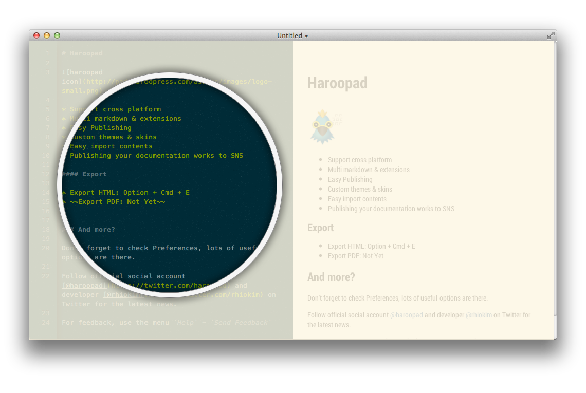

## Editing Markdown

하루패드는 **두 영역**으로 나뉜다. 

발전된 문서 편집도구는 별도의 영역이 존재하지 않는 위지윅 형태의 성숙한 인터페이스를 제공하지만 마크다운은 경량의 웹 친화적인 포맷이고 일반 사용자들에게 널리 퍼지지 않아 아직까진 대부분 별도의 분리된 형태를 제공한다.

**에디터 영역**

좌측에 보이는 영역이 마크다운을 작성하는 영역이고

**뷰 영역**

우측 영역이 실제로 표현될 문서 형태이다.
