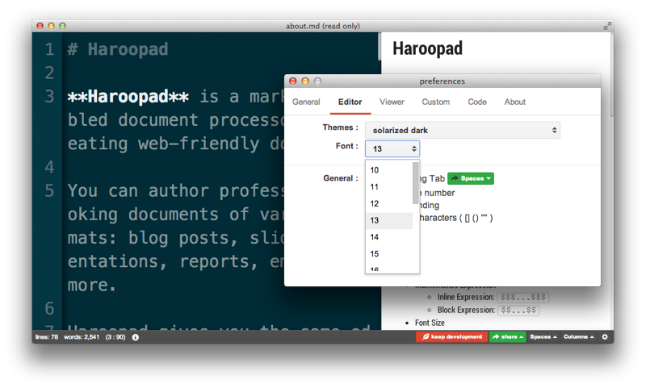

## Font Size

> 폰트 사이즈 변경은 v0.9 부터 지원합니다.

폰트 사이즈는 에디터와 뷰어로 나뉘어 제공합니다.

### 에디터 폰트 사이즈

Preference > Editor Tab > Font 설정으로 폰트 사이즈를 조절할 수 있습니다.

단축키 : 
 * &#8984; - &#8997; - . : 에디터 폰트 사이즈 +1px
 * &#8984; - &#8997; - , : 에디터 폰트 사이즈 -1px

### 뷰어 폰트 사이즈

Preference > Viewer Tab > Font 설정으로 폰트 사이즈를 조절할 수 있습니다.

단축키 :
&#8984; - &#8679; - .          | 뷰어 폰트 사이즈 +1px
&#8984; - &#8679; - ,          | 뷰어 폰트 사이즈 -1px