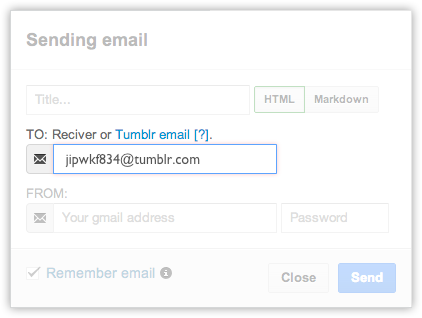

# How to posting into tumblr

텀블러는 이메일을 통한 포스팅 기능을 지원한다. 뿐만 아니라 마크다운을 일부 지원하여 좀더 구조적인 문서로 블로깅을 할 수 있다.

## Email

[하루패드의 메일 기능](http://pad.haroopress.com/page.html?f=send-beautiful-email)은 [텀블러 이메일 포스팅](http://www.tumblr.com/docs/en/email_publishing) 기능을 구현하면서 착안된 기능이다.

하루패드를 이용해 텀블러에 포스팅을 하기 위해서는 하루패드 메일 사용법을 이해해야 한다.

## 고유 이메일 주소 확인하기

텀블러 이메일 포스팅을 위해서는 텀블러에서 지정해준 고유의 이메일 주소가 필요하다. 이메일 주소를 얻으려면 아래의 링크를 따라가면 잘 설명해주고 있다.

* refs: http://www.tumblr.com/docs/en/email_publishing#how

1. 자신의 텀블러에 로그인 한다.
2. https://www.tumblr.com/settings 으로 이동한다.
3. 좌측 메뉴 중 가장 아래의 **[Account]'s Note** 라는 메뉴 클릭한다.
4. 페이지 중앙 부분에 **Post by Email** 에서 자신의 텀블러 고유 이메일 주소 (예시) **jipwkf834@tumblr.com** 를 확인할 수 있다.

> 

## 포스팅

텀블러는 Text, HTML, Markdown 3가지의 형태로 포스팅을 지원하고 텀블러 환경설정에서 선택할 수 있다.

이 설정값에 따라 하루패드에서도 동일하게 지정해주면 된다. 단 여기서 몇가지 유의할 점이 있다.

* 하루패드에서 HTML 로 보낼 방식으로 보낼 경우 
> 텀블러에서 작성한 문서를 그대로 볼 수 있지만 스타일이 인라인으로 설정되어 있어 텀블러 에디터에서는 편집하기 어려울 수 있다.

굳이 선택하지 않아도 수신자 이메일 주소가 `tumblr.com` 으로 이루어져 있으면 자동으로 선택된다.

위에서 확인한 이메일 주소를 하루패드에 받는 사람(Reciver) 에 넣는다.

자 그럼 자신의 지메일 계정을 입력하고 보내기 버튼을 클릭해보자.