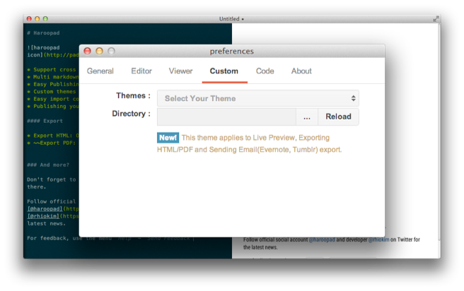

# Custom Theme based on CSS

0.7 버젼부터 추가된 하루패드의 사용자 테마 기능은 매우 심플 개발었다.

* CSS

CSS 는 일반적으로 HTML과 함께 쓰이는 문서 스타일을 지정하기 위한 언어로 하루패드의 모든 테마들도 모두 CSS 로 정의하고 있다.

마크다운 문서가 표현되는 우측 영역은 HTML 문서인데 마크다운 문서가 HTML 로 변환되었을 때 어떤 엘리먼트들이 있는지 잘 알고 있어야 한다.

그래야 내가 원하는 테마를 쉽게 만들 수 있다.

## 하루패드 테마 작성

아주 간단한 예제를 통해 테마 작성을 이해해보자.

1. 임의의 css 파일을 생성한다. (example.css)
2. css 파일을 열고 다음과 같은 코드를 추가한다.
```css
.custom {
	font-color: red;
}
```
3. 이렇게 작성된 css 파일을 하루패드 뷰 영역에 드래그 드랍해보자.
4. 대부분의 글자 색깔이 빨간색으로 변한다. <small>(하루패드 내부적으로 적용된 기본 CSS가 있기 때문에 반영되지 않는 요소들도 존재한다.)</small>

> 이렇게 적용된 테마는 해당 윈도우에서만 적용되기 때문에 새로운 윈도우를 띄우면 반영되지 않는다.  
> 뒤에서 좀더 자세히 설명한다.

## 더 멋진 테마

좀더 복잡한 스타일을 만들어보자.

* 배경색 변경
* 텍스트 그림자 추가
* 폰트 사이즈 변경
* 헤더 폰트 색상 변경

```css
.custom {
	background-color: #afafaf;
}

.custom p, 
.custom blockquote, 
.custom h1, 
.custom h2, 
.custom h3, 
.custom h4, 
.custom h5, 
.custom h6, 
.custom li, 
.custom pre, 
.custom dl, 
.custom dt {
	text-shadow: 1px 1px 1px rgba(255, 255, 255, 1);
}

.custom p {
	font-size: 15px;
}

.custom pre>code {
	text-shadow: none;
}
```

## 웹 폰트
여기에 더해 웹 폰트도 적용해보자. Google Web Font 서비스나 TypeKit 과 같은 웹 서비스를 이용할 경우 당연하겠지만 인터넷이 되지 않는 환경에서는 폰트가 적용되지 않으니 이점을 유의하자.

```css
@import url(http://fonts.googleapis.com/css?family=Vollkorn:400italic,400,700);

.custom {
	font-family: 'Vollkorn', sans-serif;
	text-shadow: 1px 1px 1px #111;
}
```

위에 작성한 CSS 를 저장하고 하루패드 뷰 영역에 드래그 앤 드랍해보자. 해당 스타일이 변경된 것을 확인할 수 있다.

뿐만아니라 최신의 CSS3(애니메이션, 트랜지션 등)을 모두 적용할 수 있다. 테스트를 위해 여러가지 스타일을 적용해 보았지만 문서를 위한 가장 기본적인 스타일만 적용하기를 권장한다.

> 기본적인 문서 요소에 대한 스타일을 제외한 CSS 이미지, 애니메이션, 트랜지션/트랜스폼 등의 스타일은 하루패드 기능(메일, PDF/HTML 출력 등)의 일부에서 원하는 데로 동작하지 않을 수 있습니다.

* 예시 - [CSS 테마 다운로드](/docs/preferences-custom-theme/res/example.css)


## 하루패드 기본 테마

하루패드에 사용자 테마를 적용하기 위한 셀렉터 구성은 마크다운을 이해하고 있어야 쉽다. 

하지만 여기서 모든것을 설명할 수 없으니 현재 하루패드에 탑재된 테마의 소스를 살펴보기를 권장한다.

하루패드에 기본적으로 추가되어 있는 뷰 테마는 [rhiokim/markdonw-css](https://github.com/rhiokim/markdown-css) 를 사용하고 있다.

이는 [less](http://lesscss.org) 를 기반으로 하고 있어 해당 프로젝트를 fork 해 원하는 스타일을 좀더 전문가스럽게 작성할 수도 있다.

이 프로젝트는 하루패드에 뷰 테마로 공식적으로 추가하기 위한 테마로 사용자 테마 작성 시 참고하면 유용하다.

> 이 프로젝트를 기반으로 테마를 제작하시다 공유하고 싶은 테마가 있으면 Github를 통해 Pull Request 해주시면 이름과 함께 공식 테마로 등록할 예정입니다.  
>
> 현재는 하루패드 사용자가 만든 테마를 유저간에 공유할 수 있는 통로가 없어서 향후  사용자 테마를 랭킹하고 유저간에 공유할 수 있는 공간을 만들 예정입니다.

## 사용자 테마 환경설정

하루패드는 테마를 사용자가 지정한 폴더를 통해 쉽게 관리할 수 있다. `Preferences > Custom tab` 에서 `Directory` 에 테마 폴더를 지정해주면 된다.

 

위에서 작성되거나 친구나 직장 동료의 테마 묶음을 특정 폴더에 복사해 넣고 위의 이미지와 같이 해당 디렉토리를 지정한다.

 

Reload 버튼 왼쪽에 있는 `...` 으로 표시된 버튼을 클릭하고 해당 위치를 선택하자.

 

선택이 되면 자동으로 선택 목록에 확장자가 `*.css` 로 된 모든 파일이 표시된다.

자 이제 문서를 작성하고 내가 적용하고 싶은 테마를 적용해보자.

## 참고 사항

사용자 테마를 통해 적용된 일부 스타일은 **이메일, HTML/PDF 출력등에서 적용되지 않을 수 있습니다.**