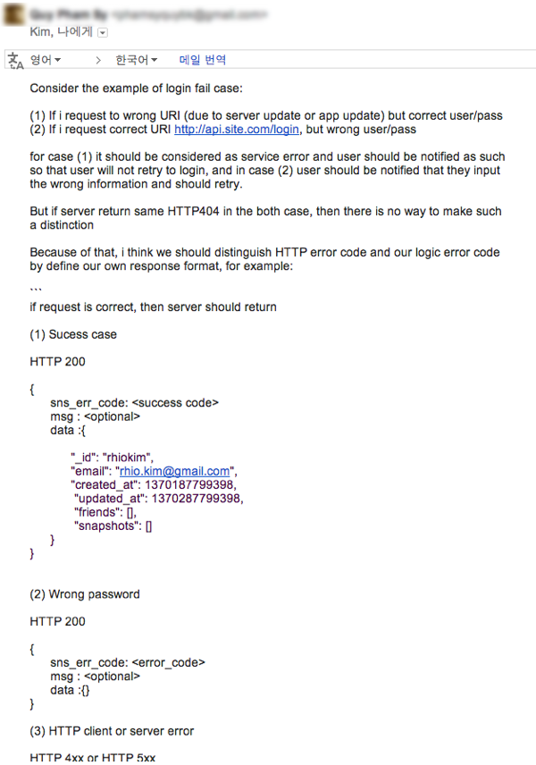
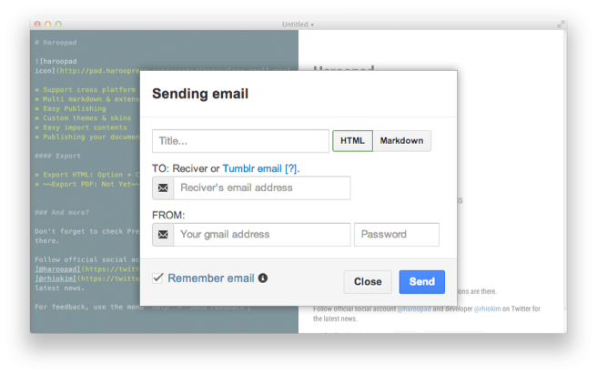
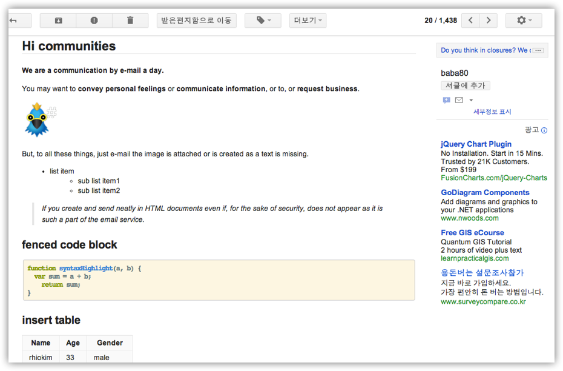
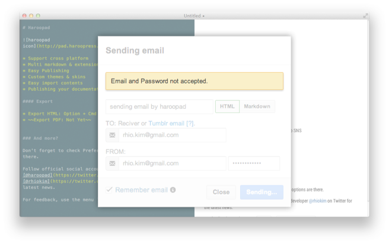

## Sending beautiful email by Haroopad
**우리는 하루에도 수십통의 이메일을 주고 받습니다.**  

아래 내용은 과거 동료 개발자로부터 서버 로직 개선에 대한 의견으로 받은 메일이다.  
천천히 읽어 내려가면 무슨 이야기를 하는지 잘 이해할 수 있다.

> 

하지만 하루에도 수 많은 정보들이 다양한 채널을 통해 들어오고 수 십통의 메일이 이와 같은 텍스트라면 정보의 홍수 속에서 필요한 정보를 놓치는 실수를 종종하게 될 것이다.

**보스와의 중요한 메일**, **협력사와의 중요한 메일**에서 실수가 발생한다면 과연 어떻게 될까?

좀더 가독성 있게 메일을 작성할 수 있다면 그 실수는 많이 줄어들 것이다.

그래서 하루패드에서는 관습적인 메일 작성에서 착안된 마크다운 포맷을 그대로 메일에 적용하였다.

### 메일 보내기

`File` 메뉴에 `Sending...` 기능을 클릭해도 위와 같은 다이얼로그가 나타난다.

> 메일 보내기 단축키 `COMMAND(Ctrl) + Shift + E`는 하루패드에서 앞으로 자주 쓰게 될 단축키이니 익숙해지면 좋다.

그럼 자세히 살펴보자.

##### 제목 입력

간단히 메일 제목을 입력하면 된다. 입력하지 않더라도 자동으로 본문 내용중 H1~H6 태그중 가장 윗줄에 존재하는 헤더 구문의 내용을 자동으로 채워준다.

##### 문서 형태 선택

하루패드의 좌측은 에디터 영역 우측은 뷰어 영역이다.  메일을 보낼때 에디터 영역의 내용을 보낼지 우측의 변환된 문서 형태로 보낼 것인지 설정하는 것이다.

특별한 경우가 아니라면 HTML이 기본값이다.

##### 받는사람(Reciver) 설정

이 메일을 받을 사람의 이메일 주소를 입력하면 된다.  다이얼로그 좌측 하단을 보면 `Remember email` 체크박스를 체크하면 받는 사람 메일 주소가 저장되어 자동완성으로 재 사용할 수 있다.

##### 보내는 사람 설정

보내는 사람은 현재 **본인의 구글 계정**을 통해서만 보낼 수 있다. 입력한 메일 주소와 패스워드로 구글 SMTP 인증 후 메일을 보내게 된다.

그러면 구글 계정과 패스워드를 입력하자.

`Remeber email` 을 체크하면 보낸 사람의  이메일 주소도 저장된다. **단, 비밀번호는 저장되지 않는다.**

##### 메일 보내기

마지막으로 우측 하단에 `Send` 버튼을 클릭하면 메일이 전송된다.

##### 메일 예시

다음은 하루패드에서 작성해 구글로 보낸 메일 예시이다. 누가봐도 보기 편하고 문서의 요소들이 무엇을 말할 수 있는지 한눈에 알 수 있다.

---

##### 비밀 번호 오류

**메일이나 비밀번호 입력 오류로 다음과 같은 메세지가 표시되면 하루패드 재 시작해야 한다.** 그리고 메일과 비밀번호를 정확히 입력 후 보내야 한다.

