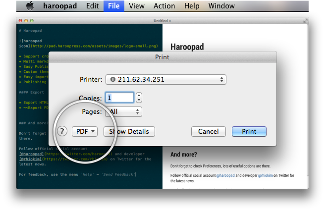

## Export to PDF

하루패드에서 마크다운 문서를 PDF 로 출력하려면 [Adobe Reader](http://get.adobe.com/kr/reader) 가 컴퓨터에 설치되어 있어야 한다.

컴퓨터에서 PDF 문서를 볼 수 있다면 이미 설치되어 있다. 설치되지 않았다면  http://get.adobe.com/kr/reader 에서 무료로 얻을 수 있으니 다운로드 후 설치하자.

설치가 완료되었다면 마크다운 문서를 불러와 PDF 로 저장해보자.

### PDF 로 저장하기

File 메뉴에 Print 메뉴가 있다. 이 메뉴는 마크다운에서 작성한 문서를 인쇄하기 위한 기능인데  Adobe Reader 를 설치했다면 여기에서 PDF 로 저장할 수 있게 된다.

프린트 다이얼로그가 뜨면 아래의 이미지에서 보이듯이 선택 옵션을 클릭해보자.

여기에 표시한 이미지들은 맥 운영체제를 캡쳐해서 윈도우와 리눅스와는 다를 수 있다.

선택 옵션을 클릭하면 PDF 와 관련된 많은 메뉴들이 뜨고 여기에서 `Save as PDF`를 클릭하자.

PDF 저장 다이얼로그가 뜨고 몇가지 입력사항을 입력 후 `Save` 버튼을 클릭하면 PDF 로 출력된다.