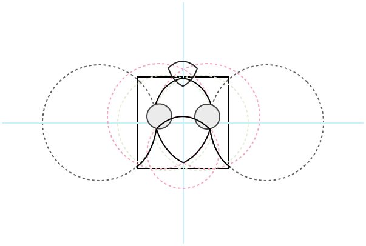

## Release Haroopad 0.4.8

**Haroopad** is a document processor for creating web-friendly document in markdown editor.

You can also based on the markdown, to create Web documents, blogs, as well as e-mail, the report documents expert.

And then support Windows, Linux, the Mac OS, you get the experience of editing the same document markdown in the desired platform.

### Concepts

1. Anywhere readable document
2. Anywhere writable document
3. Anywhere publish document
4. Connect to cloud
5. Connect with contents management system
6. Embeding & Importing any contents

The official version, was developed under the enhancement of the most basic features of a mark-down editor.

Future versions (0.5.x) or later, and will feature a variety that can not be experienced is added in the markdown editor existing.

### Teaser

<iframe src="http://player.vimeo.com/video/70385914?title=0&byline=0&portrait=0" width="500" height="281" frameborder="0" webkitAllowFullScreen mozallowfullscreen allowFullScreen></iframe> 
<a href="http://vimeo.com/70385914">The next document processor</a> from <a href="http://vimeo.com/rhio">rhiokim</a> on <a href="https://vimeo.com">Vimeo</a>. / music "Summers Coming" by Dexter Britain (http://dexterbritain.co.uk)

### Main Features / 0.4.7

* Support cross platform
  - Window
  - Mac OS X
  - Linux 32/64
* MultiMarkdown (GFM) & extensions
	- Gitub Flavored Markdown
	- Smartpants
* Theme for editing
	- Solaraized Dark & Light based CodeMirror
* Live Preview themes
	- 7 themes based [markdown-css](https//github.com/rhiokim/markdown-css)
* Syntax Highlighting
	- 52 languages & 26 styles based highlight.js
* Vim Key-binding
* Export to PDF, HTML

### Up Coming Features / 0.5

* Send email
  - 
* Post to tumblr
  - 

### Download & Install

1. [Official site](http://pad.haroopress.com/user.html)
2. [Download & Install](http://pad.haroopress.com/user.html#download)

### And more ?

* Official site : [http://pad.haroopress.com][haroopad]
* Blog & Manual : [http://pad.haroopress.com/page.html][blog]
* User echo : [http://haroopad.userecho.com][userecho]

Don't forget to check Preferences, lots of useful options are there.

Follow official social account [@haroopad](https://twitter.com/haroopad) and developer [@rhiokim](https://twitter.com/rhiokim) on Twitter for the latest news.

For feedback, use the menu `Help` - `User Echo`

[haroopad]: http://pad.haroopress.com
[blog]: http://pad.haroopress.com/page.html
[userecho]: http://haroopad.userecho.com