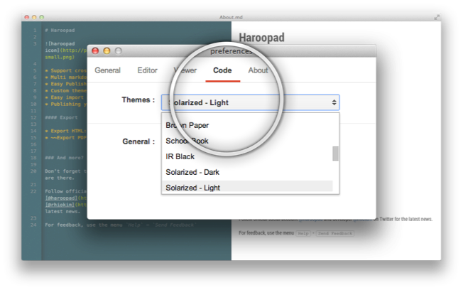

## Configuration Viewer

#### theme

하루패드는 마크다운을 웹 문서로 변환을 하기 때문에 테마를 커스터마이징하기도 간단하다.

하루패드는 기본적으로 7가지의 표준 문서 테마를 제공합니다.

Markdown CSS 표준 프로젝트 : [http://rhiokim.github.com/markdown-css](http://rhiokim.github.com/markdown-css) 을 기반으로 하여 원하는 테마를 손쉽게 제작할 수 있다.

#### code style

멀티 마크다운에 팬스 코드 블럭(Fenced Code block)은 프로그래머들 사이에서 자주 사용한다.

그리고 프로그래밍 언어의 종류는 매우 많아 개별적으로 구문 강조하기란 쉬운일이 아니고 원하는 스타일을 적용하기 쉽지 않다.

.

하지만 하루패드에서는 54가지의 프로그래밍 언어와 26가지의 구문 강조 스타일을 제공한다.

코드 스타일 테마와 지원 언어에 대한 정보는 [여기](http://softwaremaniacs.org/media/soft/highlight/test.html)를 참고하세요.

