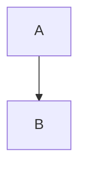
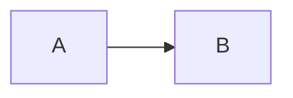
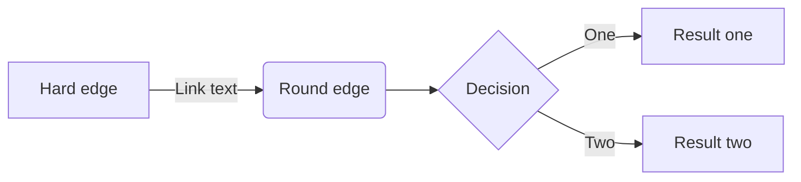
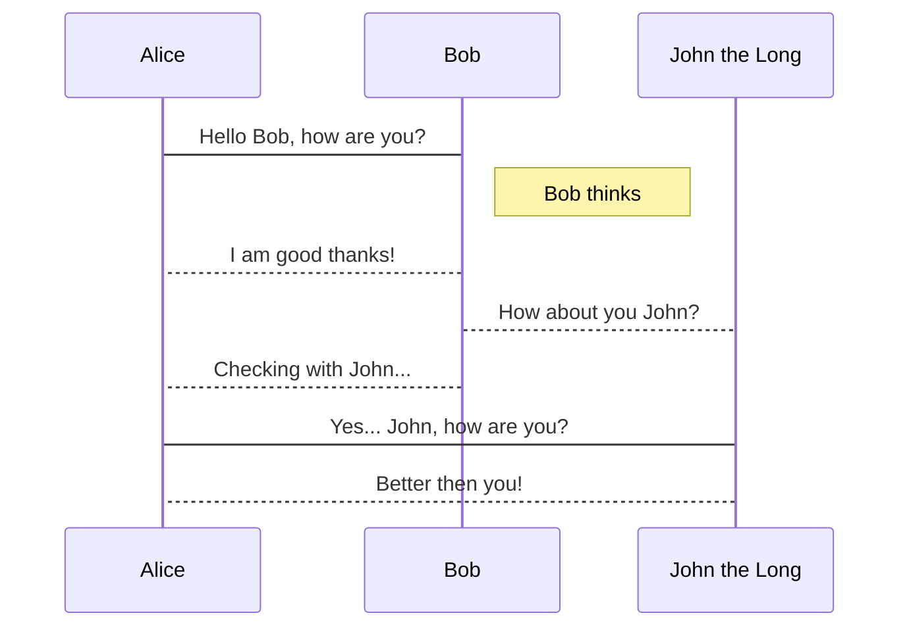
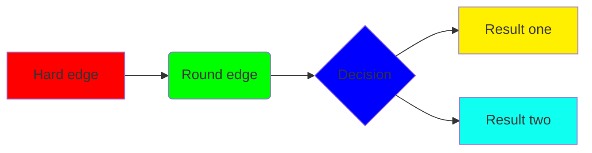

# How to draw diagram using by Haroopad

우리는 일상 생활에서 일련의 작업들의 논리적인 모습을 다이어그램으로 표현하는 경우가 많습니다. 가장 많이 사용하는게 다이어그램인데 대부분의 위지윅 문서 도구에서는 도형 기능을 이용해 이런것들을 손쉽게 그릴 수 있도록 지원하고 있습니다.

하지만 하루패드와 같은 마크다운 문서에서는 그 방법이 그리 쉽지 않을 뿐더러 위지윅을 통해 도형을 넣거나 하는 것은 잘 어울리지 않습니다.

먼저 한번 보시죠.

## Diagram Syntax?

아래의 두가지 예시는 다이어그램을 그리는 문법입니다.

```bash
graph TD;
    A-->B;
    A-->C;
    B-->D;
    C-->D;
```

위의 구문의 특징을 살펴보면 `graph TD;` 와 `A-->B;` 의 두가지 패턴을 확인할 수 있습니다. 

`graph TD` 는 그래프 방향 지시어입니다. 그래프를 `Top-Down` 을 의미합니다.

그리고 `A-->B;` 는 A 노드가 B 를 향한다는 의미입니다.



위의 예시에 방향 지시어를 `graph LR` 로 바꾸면 다음과 같이 됩니다.



꽤 간단한 방법으로 단순한 노드의 관계를 표시하였습니다. 좀더 복잡한 예시와 결과를 살펴봅니다.

```bash
graph LR;
    A[Hard edge]-->|Link text|B(Round edge);
    B-->C{Decision};
    C-->|One|D[Result one];
    C-->|Two|E[Result two];
```



위의 문법은 이곳을 통해 좀더 자세히 알 수 있습니다.

* https://github.com/knsv/mermaid/wiki

## How to draw?

하루패드에서는 매우 단순한 방법으로 다이어그램을 표현합니다.

위와 같은 구문을 팬스 코드 블럭(Fenced Code Block)안에 넣으면 됩니다.

~~~markdown

~~~

물론 그냥 문법으로 표시되도록 한다면 팬스 코드 블럭에 `markdown` 언어를 지정해주면 됩니다.

~~~markdown
```markdown
graph TD;
    A-->B;
    A-->C;
    B-->D;
    C-->D;
```
~~~

## How to advanced


**Sequence Diagram**


**Styling**


**Dot Syntax**
```mermaid
digraph
{
a -> b -> c -- d -> e;
a -- e;
}
```
## Thanks to

인어라는 뜻의 `Mermaid` 하루패드에서 다이어그램을 지원할 수 있었던 이유중에 하나는 Knut Sveidqvist 씨가 개발한 [https://github.com/knsv](https://github.com/knsv) 덕분입니다.

기존에 이와 유사한 몇가지 오픈소스가 있었지만 동작에 필요한 리소스 비용과 퍼포먼스가 너무 높아 지원하지 못했으나 mermaid 는 좀더 가볍게 브라우저 기반으로 동작하기 때문에 하루패드에서도 가능하게 되었습니다.