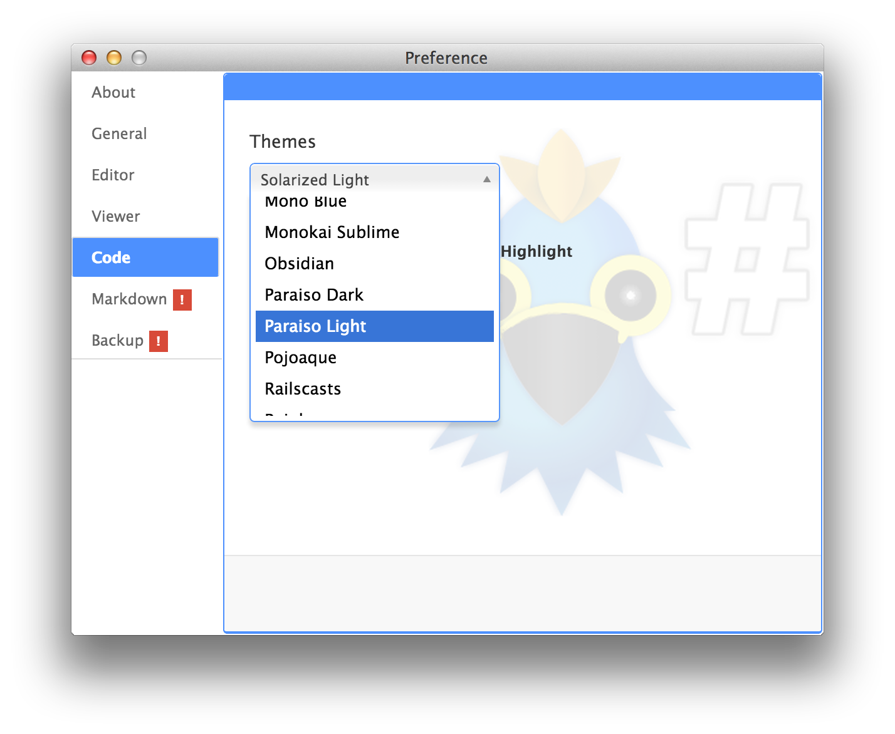

# How to use fenced code block

하루패드는 **71 가지 언어**의 구문 강조를 지원하고 **44 가지의 구문 강조 테마**를 제공합니다.

## Fenced code block Syntax

하루패드는 간단한 방법으로 코드 구문 강조 기능을 사용 할수 있습니다.  먼저 마크다운에서 코드 블럭을 지정하는 방법을 알아봅니다.

마크다운에서 기본 코드 블럭은 한개의 탭 혹은 세개의 공백입니다.

<pre><code class="markdown">    function syntaxHighlight(code, lang) {
       var foo = 'rhio';
       var bar = 33;
    }
</code></pre>

**결과**

    function syntaxHighlight(code, lang) {
       var foo = 'rhio';
       var bar = 33;
    }

위와 같이 코드 블럭이지만 우리가 흔히 개발 도구에서 보던 구문 강조가 되지 않아 문서내에 코드 가독성이 조금 떨어지고 익숙하지 않게 느껴집니다.

그래서 마크다운을 즐겨쓰는  [Github.com](http://github.github.com/github-flavored-markdown/) 에서는 서비스 특성상 마크다운 문서에 코드 블럭이 많기 때문에 이점을 보안, 개선했습니다.  3개의 <code>`</code> (backtick) 을 연달아 작성하는 것으로 구문강조 코드 블럭을 지원하면서 **Fenced Code Block**이 코드 블럭의 기본 방식처럼 되어가고 있습니다.

그외에 `~` (tilde) 3개를 이용해 코드 블럭을 지정하는 방법도 있습니다.

<pre><code class="markdown">```ruby
code block
```

~~~cpp
fenced code block
~~~

~~~javascript
function syntaxHighlight(code, lang) {
   var foo = 'rhio';
   var bar = 33;
}
~~~
</code></pre>

**결과**

```js
function syntaxHighlight(code, lang) {
   var foo = 'rhio';
   var bar = 33;
}
```

#### Other Example

**ruby**

```ruby
def syntaxHighlight
  @haroo = 'press'
  return @haroo
end
```

**python**

```python
def syntaxHighlight():
    haroo = "press"
    return haroo
```

**php**

```php
<?php
$a1=array("a"=>"red","b"=>"green","c"=>"blue");
$a2=array("a"=>"red","c"=>"blue","d"=>"pink");

$result=array_intersect_key($a1,$a2);
print_r($result);
?>
```

**java**

```java
/* HelloWorld.java
 */
public class HelloWorld
{
	public static void main(String[] args) {
		System.out.println("Hello World!");
	}
}
```

### Languages

위의 예시와 같이 코드에 적합한 언어를 지정해주면 언어에 맞게 구문 강조가 됩니다. 앞서 소개한것 처럼 하루패드는 다음과 같이 다양한 언어의 구문 강조를 지원합니다.

언어는 `key` 중에 선택하면 됩니다.

| Language                              | key            |
|:-------------------------------------:|:--------------:|
| Python                                | python         |
| Python's profiler output              | profile        |
| Ruby                                  | ruby           |
| Haml                                  | haml           |
| Perl                                  | perl           |
| PHP                                   | php            |
| Scala                                 | scala          |
| Go                                    | go             |
| XML                                   | xml            |
| HTML (with inline css and javascript) | xml            |
| Lasso                                 | lasso          |
| Markdown                              | markdown       |
| AsciiDoc                              | asciidoc       |
| Django templates                      | django         |
| Handlebars                            | handlebars     |
| CSS                                   | css            |
| SCSS                                  | scss           |
| JSON                                  | json           |
| JavaScript                            | javascript     |
| CoffeeScript                          | coffeescript   |
| ActionScript                          | actionscript   |
| VBScript                              | vbscript       |
| VB.NET                                | vbnet          |
| HTTP                                  | http           |
| Lua                                   | lua            |
| AppleScript                           | applescript    |
| Delphi                                | delphi         |
| Oxygene                               | oxygene        |
| Java                                  | java           |
| C++                                   | cpp            |
| Objective C                           | objectivec     |
| Vala                                  | vala           |
| C#                                    | cs             |
| F#                                    | fsharp         |
| OCaml                                 | ocaml          |
| D                                     | d              |
| RenderMan RSL                         | rsl            |
| RenderMan RIB                         | rib            |
| MEL (Maya Embedded Language)          | mel            |
| GLSL                                  | glsl           |
| SQL                                   | sql            |
| SmallTalk                             | smalltalk      |
| Lisp                                  | lisp           |
| Clojure                               | clojure        |
| Ini file                              | ini            |
| Apache                                | apache         |
| nginx                                 | nginx          |
| Diff                                  | diff           |
| DOS batch files                       | dos            |
| Bash                                  | bash           |
| Makefile                              | makefile       |
| CMake                                 | cmake          |
| Axapta                                | axapta         |
| Oracle Rules Language                 | ruleslanguage  |
| 1C                                    | 1c             |
| AVR Assembler                         | avrasm         |
| VHDL                                  | vhdl           |
| Parser 3                              | parser3        |
| LiveCode Server                       | livecodeserver |
| TeX                                   | tex            |
| BrainFuck                             | brainfuck      |
| Haskell                               | haskell        |
| Erlang                                | erlang         |
| Erlang REPL                           | erlang-repl    |
| Rust                                  | rust           |
| Matlab                                | matlab         |
| Scilab                                | scilab         |
| R                                     | r              |
| Mizar                                 | mizar          |
| Mathematica                           | mathematica    |
| AutoHotkey                            | autohotkey     |
| FIX                                   | fix            |

### Themes

개발 도구의 구문 강조 테마로 잘 알려진 Solarized, Tomorrow 씨리즈는 기본으로 Github 스타일도 제공합니다.

하루패드에서 코드 구문 강조를 위한 테마는 환경설정에서 지정할 수 있습니다.



위의 그림과 같이 "환경설정(Preference) > 코드(Code) 탭 > 테마(Themes) 섹션' 에서 선택할 수 있습니다. 설정이 변경되면 모든 코드 블럭에 지정한 테마가 적용됩니다.

테마 라이브 데모는 [여기](http://softwaremaniacs.org/media/soft/highlight/test.html)를 참고하세요.

## See more

* https://help.github.com/articles/github-flavored-markdown#syntax-highlighting
* http://highlightjs.org/