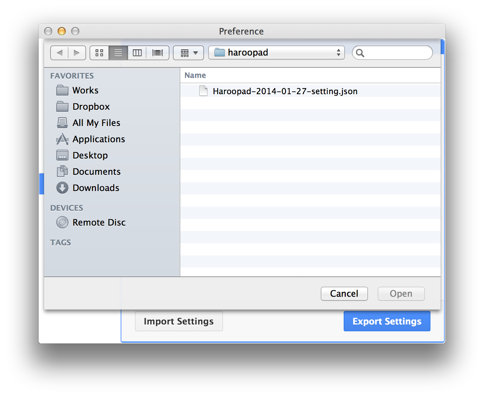

# 하루패드 환경설정 내보내고 가져오기

> 이 기능은 v0.11 부터 제공됩니다.

하루패드의 기능들이 많아지면서 환경설정이 매우 중요해졌습니다.

하루패드 설정을 백업해 놓거나 다른 컴퓨터에서 동일한 설정을 사용하고 싶을 때 이 기능은 꽤 편리합니다.

사용법은 매우 간단합니다.

### 환경설정 내보내기

먼저 환경설정 윈도우를 띄웁니다. 그리고 좌측 백업 메뉴를 클릭하고 원하는 환경설정 부분을 선택합니다.

기본적으로는 모든 설정을 백업하기 때문에 모두 체크되어 있습니다.

내보낼 항목을 모두 체크했다면 `Export Settings` 버튼을 클릭하여 모든 설정을 파일로 저장하게 됩니다.

파일명은 기본적으로 `Haroopad-YYYY-MM-DD-setting.json` 규칙으로 저장됩니다.

### 환경설정 가져오기

환경설정 백업 파일은 `json` 포맷입니다.  `가져오기` 버튼을 클릭하면 파일 브라우저가 표시되고 가져올 설정 파일을 선택합니다.

설정 가져오기가 완료되면 다음과 같이 다이얼로그가 표시됩니다.

하루패드 설정이 적용되고 나면 하루패드를 재시작해야 모든 설정이 완료됩니다.
