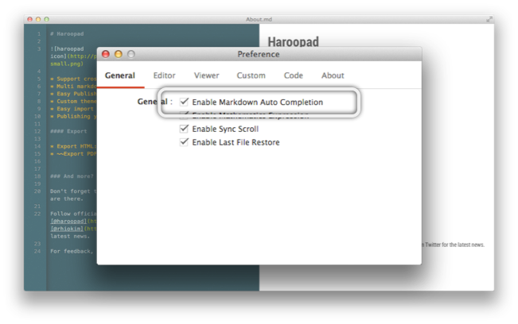
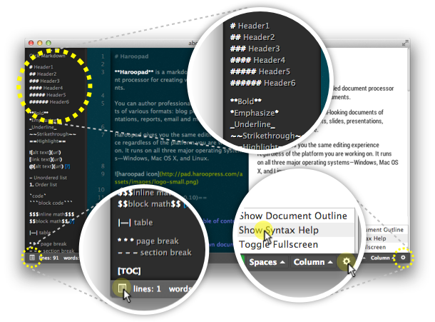
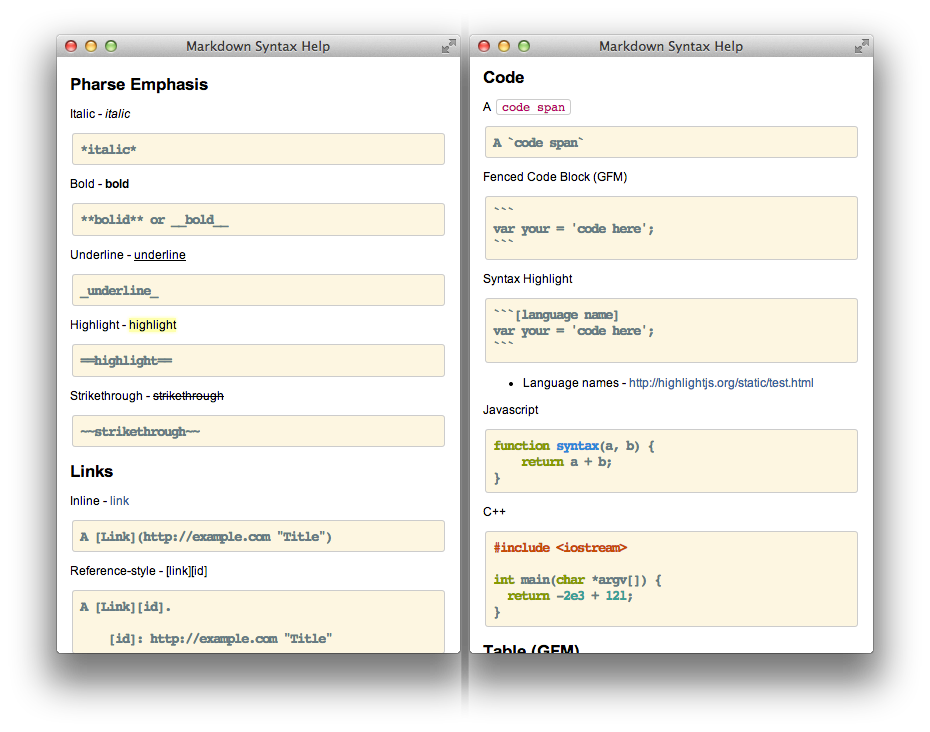

## 마크다운 자동완성

우리는 실생활에서 자동완성 기능을 매우 자주 사용합니다. 이는 자주 사용하는 검색어를 추천해주거나 개발 도구에서는 해당 컨텍스트에 맞춰 사용할 메소드나 변수를 빠르게 입력하여 하고자 하는 일에 효율을 높여줍니다.

하지만 아직까지 문서는 프로그램 코드이거나 검색에 필요한 요소가 아니기 때문에 자동완성이 사실 왜 필요할까하는 의문이 먼저 생길지 모릅니다.

하루패드에서는 마크다운 문서 작성에 효율을 높이기 위해서 마크다운 자동완성을 v0.10 에서부터 제공합니다.

### WYSIWYM

하지만 [위지윔(WYSIWYM)](http://en.wikipedia.org/wiki/WYSIWYM) 방식의 문서작성에서는 매우 유용하게 쓰일 수 있습니다.  마크다운이나 LaTeX 와 같이 이런 방식이 그 예시입니다.

### 설정 방법

마크다운 자동완성 기능은 기본적으로 사용하도록 설정되어 있습니다.  혹시 이 기능을 잠시 끄거나 다시 사용하려면 환경설정에서 다음과 같이 설정하면 됩니다.

**마크다운 자동완성 사용하기** 옵션을 체크해주시면 마크다운 작성 시 입력한 구문에 맞춰 자동 완성이 가능합니다.

-
### 자동완성 테이블

| 문자 | 자동완성            | 설명                       |
|----|-------------|----------------|
|  \`  |  \`                  | 코드                       |
|        |  \`\`\`           | 블럭 코드                |
| !      | \!\            | 이미지                    |
| [      | \               | 링크                      |
| =    |  \==                | 형광펜 효과             |
|        |  \= \= \=        | 페이지 나누기          |
|        |  \=\=\=\=\= | 제목                      |
| *     |  \**                  | 볼드                      |
|        |  \* \* \*           | 페이지 나누기          |
|        | \*\*\*\*\*        | 페이지 나누기          |
| -     | \- \- \-           | 섹션 나누기             |
|        | \-\-\-\-\-      | 문단 제목               |
| _     | \_ \_ \_            | 섹션 나누기             |
|        | \_\_\_\_\_       |                             |
| ~     | \~\~                | 취소선                   |
| @     | @\            | 임베딩                   |
| $     | $$                   | 수학 표현식 (블럭)     |
|        | $$$                 | 수학 표현식 (인라인)  |

### 마크다운 구문 도움말

자동완성 기능의 경우 마크다운에 익숙한 사람이라면 더욱 중요한 기능이지만 그렇지 않는 사람의 경우에는 제대로 활용하기는 쉽지 않습니다.

위의 이미지처럼 좌측 하단 영역에 아이콘 버튼을 클릭하면 마크다운 구문 도움말이 표시됩니다. 또한 이 도움말을 클릭하면 자동으로 에디터 영역에 자동완성을 해줍니다. 또한 우측 환경설정 메뉴에 '구문 도움말 표시'를 클릭하면 도움말이 표시됩니다.

단축키 ( <kbd>CTRL</kbd> or <kbd>COMMAND</kbd> ) + <kbd>Shift</kbd> + <kbd>H</kbd> 입니다.

왜 이런 문법을 사용하는지 문단 구조에 맞춰 사용해야할 문법이 다 다르기 때문입니다. 그런 분들을 위하 자동완성 기능 이외에도 마크다운 구문 도움말 윈도우가 있습니다.

상단 메뉴중 도움말(Help) > 마크다운 구문 도움말을 클릭하면 새로운 윈도우에 구문 도움말이 좀더 상세하게 표시됩니다.

이를 활용한다면 마크다운 문서를 좀더 빠르고 효율적으로 작성할 수 있도록 도와줄 것입니다.