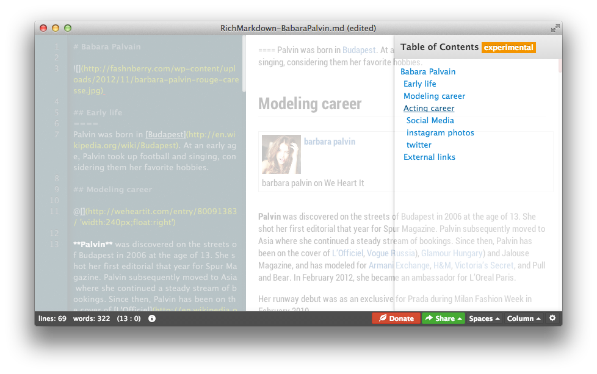

## 목차 (Table of Content)

마크다운의 태생은 메일의 관례적인 표현법에서 나왔지만 그 쓰임새는 위키 문법과 유사합니다. 텍스트 친화적인 표현법으로 정규화된 웹 문서를 생성해내기 위해서 매우 유용한 표현법입니다.

```
Chapter 1: Getting Started . . . . . . . . . . . 1
   Introduction  . . . . . . . . . . . . . . . . 2
   Next Steps  . . . . . . . . . . . . . . . . . 3
```
하지만 존 그루버에 의해 정의된 마크다운에는 좀더 많은 표현법을 구사하지 못하고 있어 커뮤니티, 특정 서비스들에서 각각의 취향, 성향에 맞는 문법들을 천천히 추가하고 있습니다.

그중에 가장 많은 니즈가 바로 이 목차 (Table of Content) 에 대한 니즈가 아닐까 싶습니다.

### 마크다운 목차 구문


위키의 경우 `__TOC__`  구문을 통해 문서내에 자동으로 문서의 목차를 생성해주도록 하고 있습니다.

그렇다면 마크다운에서는 어떤 표현법이 있을까? 대부분의 마크다운 커뮤니티와 파워 사용자들에 의해서 제안되는 몇가지가 있습니다.

깃허브 위키나 깃허브의 골룸(Gollum) 프로젝트에서는`[[TOC]]`, `[[_TOC_]]` 구문을 이야기하거나 구현하고 있습니다.

하루패드에서는 대소문자 구분 없이`[TOC]` 혹은 `[toc]` 를 입력하면 해당 위치에 목차가 자동으로 생성되도록 하였습니다.

물론 이 목차는 문서내, PDF/HTML 출력도 가능하며 메일을 보낼때에도 그대로 표현됩니다.

### Table of Contents Syntax

**마크다운 표현법**

```markdown
[TOC] or [toc]
```

**결과**

[TOC]

#### Alignment

기본적으로 목차(TOC) 문법은 블럭 요소로 렌더링됩니다. 하지만 경우에 따라 문서내에 요소로 표현하기 위해 정렬 속성을 지정하기도 합니다. 하루패드에서는 다음과 같이 정렬뿐아니라 스타일 시트를 속성을 제공합니다.

```markdown
[TOC "float:right"]
```

위와 같이 하면 목차가 우측으로 정렬이 되고 문서내 플로팅 됩니다. 거꾸로 `float:left` 를 지정할 경우 왼쪽 정렬으로 설정됩니다.


### 목차 추가기능

마크다운 문서내에 자동으로 목차를 추가하기 위한 마크다운 구문은 `[TOC]` 이지만 문서 작성 시 목차를 한눈에 보며 해당 단락으로 이동하기 위해 고정형태의 목차 기능을 별도로 제공합니다.



이 기능은 하루패드 우측 하단 설정 아이콘 > 목차(Table of Contents) 메뉴를 클릭하거나 단축키 ( <kbd>Ctrl</kbd> or <kbd>COMMAND</kbd> ) + <kbd>Shift</kbd> + <kbd>T</kbd> 를 눌러 표시하거나 숨길 수 있습니다.