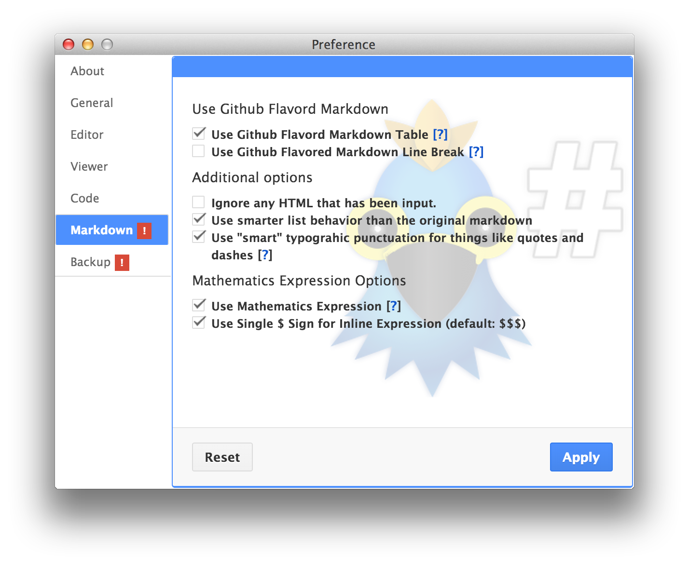

# 마크다운 옵션

> 이 기능은 v0.11 부터 제공됩니다.

마크다운도 수 많은 에디터와 워드 프로세스처럼 웹 문서를 작성하기 위한 하나의 텍스트 포맷입니다. 하지만 성숙한 도구들에 비해 마크다운 도구들은 기존의 도구들에 비해 다소 불편한 부분들이 있습니다.

이러한 부분들을 해소하기 위해 하루패드에서는 몇가지 옵션을 제공합니다.

### Github Flavored Markdown 설정

존 그루버가 만든 마크다운을 넘어 Github 를 통해 사실상 표준에 가까워진 커뮤니티가 제안하고 있는 문법들이 있습니다.

그중 가장 자주 쓰이는 테이블과 줄바꿈입니다.

* Use Github Flavored Markdown Table
* Use Github Flavored markdown Line Break

이 두가지 옵션은 Github 스타일의 테이블 문법을 사용할 것인지 선택 합니다. 그리고 줄바꿈의 경우에는 일반적으로 에디터에서 엔터를 입력하면 줄바꿈이 되지만 마크다운의 특성상 출력된 결과에서는 줄바꿈이 되지 않습니다.

그래서 엔터를 이용한 강제 개행의 경우에도 줄바꿈이 되도록 설정할 수 있습니다.
유의할 점은 2개 이상의 엔터에도 1번의 줄바꿈으로만 처리됩니다.

### 기타

* Use HTML
* Use smarter list behavior than the original markdown
* Use "smart" typographic punctuation for things like quotes and dashes
* Use Mathematics Expression

기타 옵션은 하나씩 살펴봅니다.

##### Use HTML 

이 옵션은 에디터 영역에 입력한 HTML 을 우측 뷰어 영역에서 그대로 표시할 것인지 아니면 HTML 을 렌더링할 것인지를 설정하게 됩니다.

| editor                 | viewer                              | use   |
|---------------------|---------------------------------|-------|
| \*\*bold\*\*         |  <b>bold</b>                     | false |
| \*\*bold\*\*         |  &lt;b&gt;bold&lt;/b&gt;   | true  |

##### Use smarter list behavior than the original markdown
??

##### Use "smart" typographic punctuation for things like quotes and dashes

이 옵션은 흔히 텍스트 편집에서 사용되는 구두점 자동 변환 옵션입니다.

마크다운 특성상 웹 문서로 변환될 때 하루패드는 네가지의 구두점을 자동으로 변환하게 됩니다.
 
> * <code>\`word\`</code> `"word"` 따옴표를 `“word”` 으로 변경
> * `-- word` 를 `— word` 으로 변경
> * `...` 말줄임 표현을 `…` 으로 변경

##### Use Mathematics Expression

수학 표현식은 본래 마크다운과는 별도로 LaTeX 문법을 사용하고 있지만 마크다운과 유연하게 연결되는 많이 사용됩니다.

하루패드에서 $$, $$$ 을 통해 LaTeX 구문을 파싱하여 수학 표현식을 렌더링하게 됩니다. 