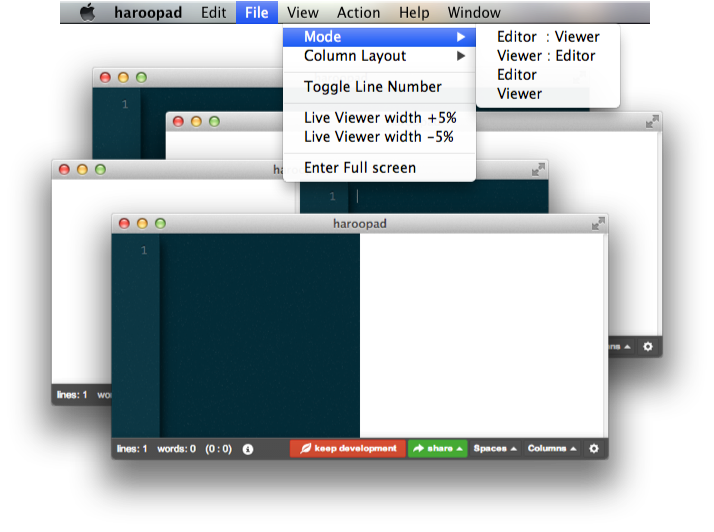
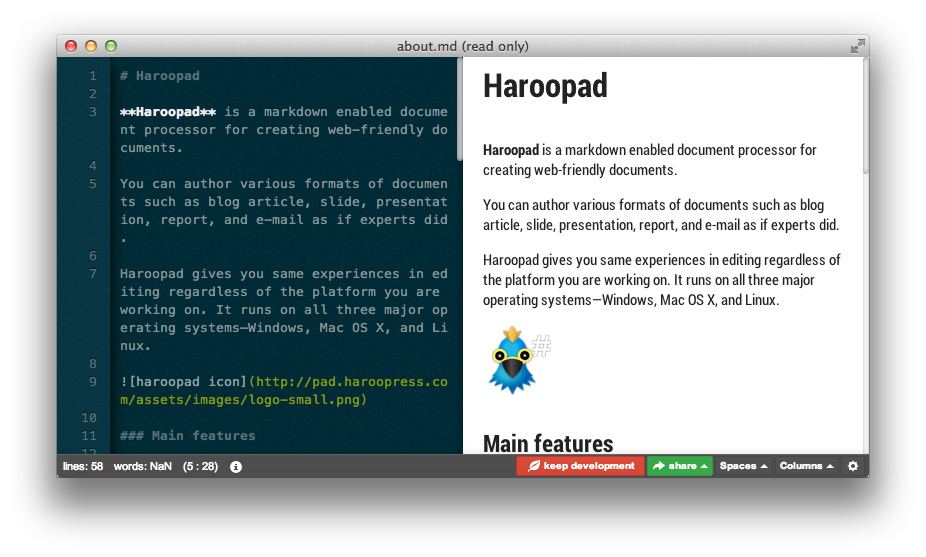
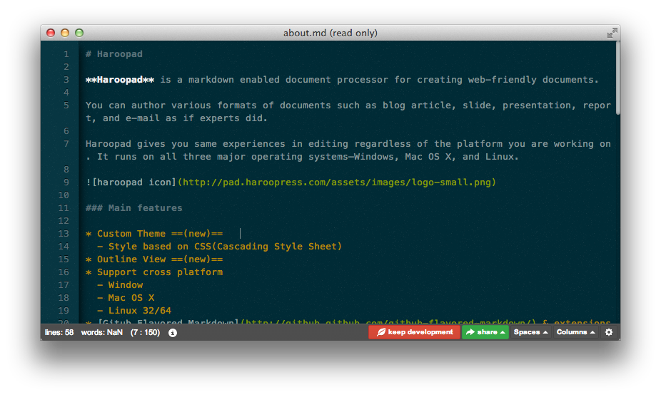
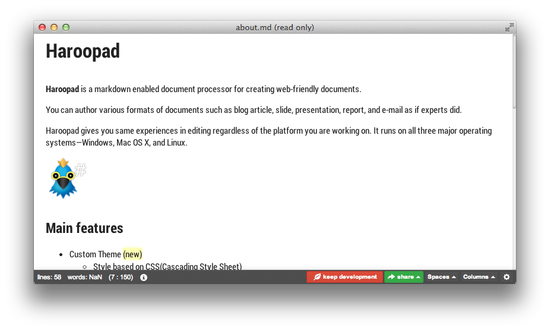

# 뷰모드 전환

> 이 기능은 0.8 부터 지원한다.

### 기본모드(default)

기본 모드는 에디터 영역과 라이브 뷰 모드로 나뉘어 표시된다.

### 리버스모드(reverse)

역방향 모드이다. 에디터 영역과 라이브 뷰 영역이 바뀌어 표시된다.

### 에디터 모드

에디터 모드는 전문적인 마크다운 에디팅을 위한 에디터 윈도우만 존재한다.

### 뷰 모드

편집이 불가능하고 현재 문서를 전체화면으로 보고 싶을 때 이용하면 좋다.

### 단축키

| 단축키                   | 설명            |
|-------------------------|----------------|
| Ctrl(COMMAND) - Alt - 1 | 에디터 : 뷰어 모드 |
| Ctrl(COMMAND) - Alt - 2 | 뷰어 : 에디터 모드 |
| Ctrl(COMMAND) - Alt - 3 | 에디터 모드       |
| Ctrl(COMMAND) - Alt - 4 | 뷰모드           |