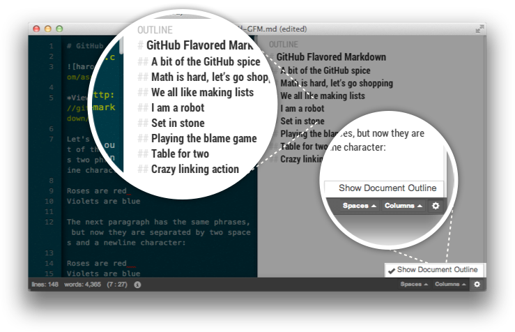

# Outline View

개요보기 기능은 대부분의 워드 프로세서가 갖고 있는 기능이다. 

작은 한장의 문서를 작성할 때는 이 기능이 그다지 필요하지 않지만 여러장 혹은 문서의 구성이 명료한 문서에서는 이 기능이 꽤 필요하다.

## 개요보기 기능 소개

개요보기 기능은 하루패드 하단 가장 우측 부분에 새롭게 생긴 아이콘이 버튼이 있다.

이 버튼을 클릭하면 **Show Document Outline** 이라는 메뉴가 표시된다.

이 기능은 토글되므로 해당 기능을 클릭하면 하루패드 라이브 뷰 영역에 내용이 헤더만 남고 모두 사라지게 된다.

### 이 기능에 대해서
이번 0.7 출시 버젼에서는 가장 기본적인 목차 수준의 개요보기만 제공한다.

아직까지 마크다운 문서를 작성할 때 개요의 활용에 대한 니즈가 어떻게 생겨날 지 모르기 때문이다.

향후 일반적인 위키 문서의 TOC(Table Of Content) 와 같이 해당 챕터나 위치로 바로가기 기능, 해당 챕터를 숨기고 펼치는 기능등을 고려중이다.