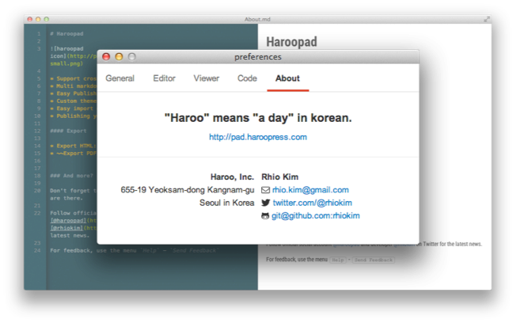
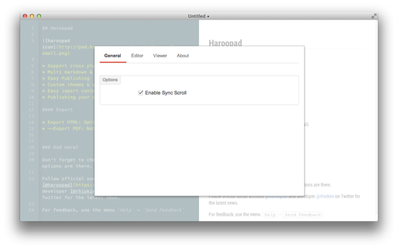
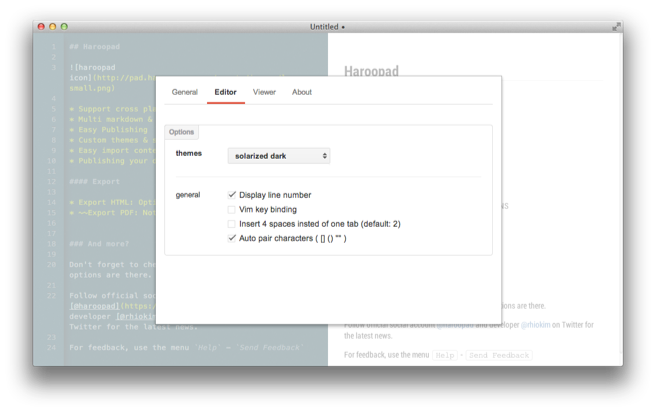
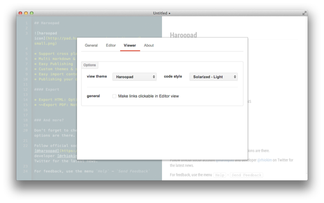

## Preferences

환경설정 옵션에서는 하루패드의 몇 가지 설정값을 통해 좀더 나은 마크다운 편집 경험을 제공한다.

#### About

하루패드에 대한 간략한 소개와 공식 사이트, 제작자 정보를 제공한다.  

#### General

일반(General)탭에는 하루패드의 기본적인 설정 옵션을 설정할 수 있다.

**Enable Sync Scroll** 를 체크 상태로 두면 에디터 영역과 뷰 영역의 스크롤 위치 동기화가 되며 긴 문서를 편집 시 에디터 스크롤 위치에 비례하여 뷰 영역의 스크롤이 알맞게 이동한다.

#### Editor

에디터 탭에는 [테마](#configuration-editor)와 4가지 옵션을 제공한다.  테마 설정에 대한 내용은 별도의 페이지에서 설명한다.

* Display line number
* Vim key binding
* Insert 4 spaces insted of on tab (default 2)
* Auto pair characters ( [], (), "" )

**Display line number** 를 체크 상태로 두면 에디터의 줄 번호가 표시된다.

**Vim key binding** 를 체크 상태로 두면 VI 에디팅을 즐겨 쓰는 사람(흔히 개발자)들에게 익숙한 키 인터페이스를 제공하기 위한 옵션이다.

**Insert 4 spaces insted of on tab** 에디터의 탭의 스페이스 사이즈를 지정하는 것이다. 하루패드는 기본적으로 탭 하나는 2개의 공백(space)를 의미한다.

**Auto pair characters** 는 프로그래밍에서 자주 쓰는 기능이나 마크다운 편집시에도 괄호나 큰따옴표등은 대부분 짝으로 필요하기 때문에 하나의 괄호만 치더면 자동으로 짝에 맞춰 글자를 생성해주는 옵션이다.

#### Viewer

뷰어 탭에는 [테마](), [코드 스타일]() 과 1개의 옵션을 제공한다.  테마 설정에 대한 내용은 별도의 페이지에서 설명한다.

* Make links clickable in viewer

**Make links clickable in viewer** 옵션은 문서에 링크가 포함된 경우 뷰 영역에서 실제로 링크를 클릭 동작 여부를 설정하게 된다. 체크한 상태라면 클릭 시 시스템 기본 브라우저에 링크가 열린다.

