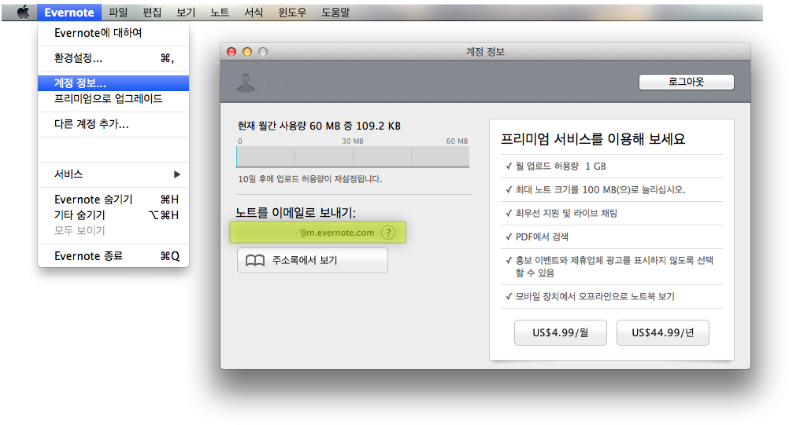

# How to publish into my evernote

에버노트는 텀블러와 유사하게 이메일을 통한 문서 퍼블리싱 기능을 지원한다.

그런데 텀블러와 다르게 마크다운은 지원하지 않기 때문에 스타일된 문서 작성은 에버노트에서 직접하거나 하루패드와 같은 마크다운 프리뷰를 지원하는 에디터에서 편집 후 복사 & 붙여넣기로 문서를 작성해야 한다.

이런 불편함을 해소할 수 있는 기능이 하루패드에 있다.

하루패드를 이용해 에버노트에 퍼블리싱을 하기 위해서는 [하루패드의 메일 기능](http://pad.haroopress.com/page.html?f=send-beautiful-email) 사용법을 먼저 이해해야 한다.

메일 사용법을 어느 정도 이해헀다면 다음으로 넘어가자.

## 에버노트 고유 이메일 주소 확인하기

에버노트 이메일 퍼블리싱을 위해서 계정마다 지정해준 고유의 이메일 주소가 필요하다. 이메일 주소를 얻으려면 아래의 이미지를 보면 쉽게 알 수 있다.

1. 에버노트 애플리케이션을 실행한다.
2. 에버노트 메뉴 > 계정 정보 메뉴를 클릭한다.
3. 다이얼로그가 뜨고 "**노트를 이메일로 보내기**" 바로 아래 자신의 고유 메일 주소를 확인할 수 있다.  
   그림에서는 ==형광색==으로 선택된 부분입니다.

내 고유 에버노트 이메일 주소를 확인했다면 메일 기능을 이용해 작성한 문서를 에버노트로 보내보자.

* Tip
> 에버노트로 퍼블리싱할 때 몇가지 알고 있으면 유용한 규칙  
> * (English) http://blog.evernote.com/blog/2010/03/16/emailing-into-evernote-just-got-better/
> * (한글) http://blog.daum.net/tkinfo/130

### References

* http://blog.evernote.com/blog/2013/07/19/quick-tip-emailing-into-evernote-plus-email-tips/
* http://blog.evernote.com/blog/2010/03/16/emailing-into-evernote-just-got-better/