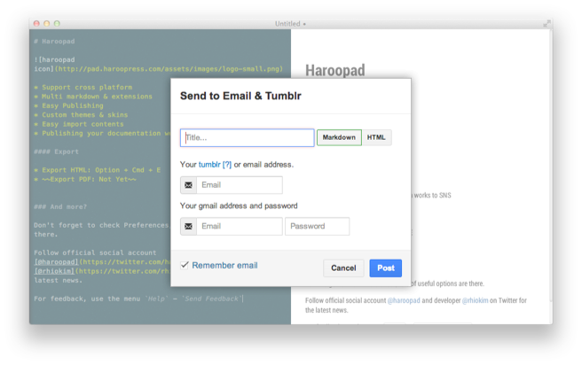
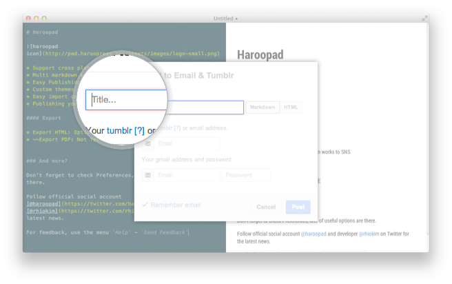
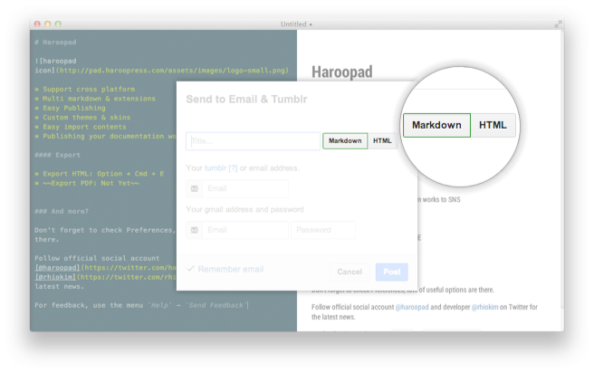
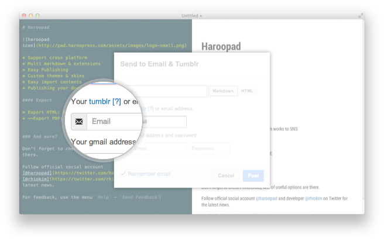
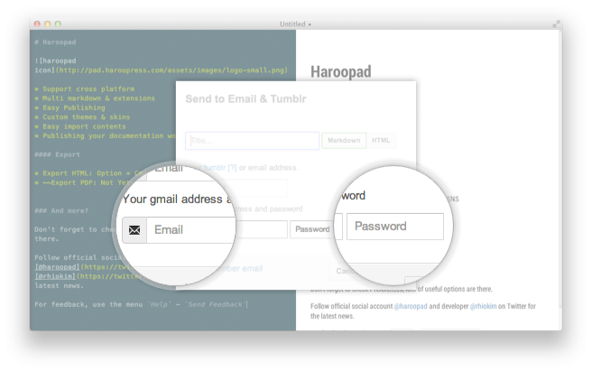
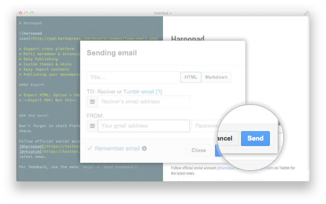

**우리는 하루에도 수십통의 이메일을 주고 받습니다.**  

아래 내용은 과거 동료 개발자로부터 서버 로직 개선에 대한 의견으로 받은 메일이다.  천천히 읽어 내려가면 무슨 이야기를 하는지 잘 이해할 수 있다.

> 

하지만 하루에도 수 많은 정보들이 눈을 통해 들어오고 수 십통의 메일이 이와 같은 텍스트라면 정보의 홍수 속에서 필요한 정보를 놓치는 실수를 종종하게 될 것이다.

**보스와의 중요한 메일**, **협력사와의 중요한 메일**에서 실수가 발생한다면 과연 어떻게 될까요?

좀더 가독성 있게 메일을 작성할 수 있다면 그 실수는 많이 줄어들 것입니다. 그동안 가독성을 위해서 위지윅이 굉장히 발달해 왔으나 빠른 정보 전달을 위한 메일을 이용할 때 위지윅은 사실 큰 힘을 발휘하지 못한다.

그래서 하루패드에서는 관습적인 메일 작성에서 착안된 마크다운 포맷을 그대로 메일에 적용하였다.

### 메일 보내기

`COMMAND + Shift + T` 단축키는 하루패드에서 가장 자주쓰게 될 단축키이니 익숙해지면 좋다. 혹은 tools 메뉴에 email 기능을 클릭해도 위와 같은 다이얼로그가 나타난다.

자세히 살펴보자.

##### 제목 입력

간단히 메일 제목을 입력하면 된다. (현 v0.5.0) 향후 버전에서는 자동으로 메일 내용중 첫번째 Header 내용이 채워지게 할 예정이다.

##### 문서 형태 선택

하루패드의 좌측은 에디터 영역 우측은 뷰어 영역이다.  메일을 보낼때 에디터 영역의 내용을 보낼 것인지 우측의 변환된 문서 형태로 보낼 것인지에 대해서 설정하는 것이다.

특별한 경우가 아닌 경우라면 기본은 HTML 이 될 것이다.

##### 받는사람 설정

이 메일을 받을 사람의 이메일 주소를 입력하면 된다.  다이얼로그 좌측 하단을 보면 `Remember email` 체크박스를 체크하면 받는 사람 메일 주소가 저장되어 나중에 보낼때 손쉽게 선택하여 보낼 수 있다.

##### 보내는 사람 설정

보내는 사람 설정하기에 앞서 유의해야할 사항은 현(v0.5.0) 버젼에서는 **구글 계정을 통해서만 보낼 수 있다.**

그러면 구글 계정과 패스워드를 입력하자. 여기 역시 마찬가지로 `Remeber email` 을 체크하면 구글 이메일 주소도 저장된다. **단, 비밀번호는 저장되지 않고 메일을 보낼때만 사용된다.** 

