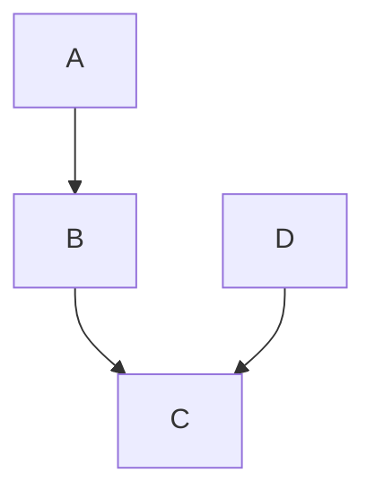

## Standard Markdown

* \\   backslash
* \`   backtick
* \*   asterisk
* \_   underscore
* \{\}  curly braces
* \[\]  square brackets
* \(\)  parentheses
* \#   hash mark
* \+   plus sign
* \-   minus sign (hyphen)
* \.   dot
* \!   exclamation mark

##### HEADERS

```markdown
This is an H1
=============

This is an H2
-------------
```

Any number of underlining =’s or -’s will work.

```markdown
# This is an H1

## This is an H2

###### This is an H6
```

##### BLOCKQUOTES

```markdown
> This is the first level of quoting.
>
> > This is nested blockquote.
>
> Back to the first level.
```

Blockquotes can contain other Markdown elements, including headers, lists, and code blocks:

```markdown
> ## This is a header.
> 
> 1.   This is the first list item.
> 2.   This is the second list item.
> 
> Here's some example code:
> 
>     return shell_exec("echo $input | $markdown_script");
```

##### LISTS

```markdown
*   Red
*   Green
*   Blue
```

is equivalent to:

```markdown
+   Red
+   Green
+   Blue
```

and:

```
-   Red
-   Green
-   Blue
```

Ordered lists use numbers followed by periods:

```
1.  Bird
2.  McHale
3.  Parish
```

##### CODE BLOCKS

```markdown
    This is a normal paragraph:
    
        This is a code block.
```
        
One level of indentation — 4 spaces or 1 tab — is removed from each line of the code block. For example, this:

```markdown
    Here is an example of AppleScript:
    
        tell application "Foo"
            beep
        end tell
```

##### HORIZONTAL RULES

```markdown
* * *

***

*****

- - -

---------------------------------------
```

##### LINKS

```markdown
This is [an example](http://example.com/ "Title") inline link.

[This link](http://example.net/) has no title attribute.
```
    
Here’s an example of reference links in action:

```markdown
I get 10 times more traffic from [Google][] than from
[Yahoo][] or [MSN][].

  [google]: http://google.com/        "Google"
  [yahoo]:  http://search.yahoo.com/  "Yahoo Search"
  [msn]:    http://search.msn.com/    "MSN Search"
```

##### EMPHASIS

```markdown
*single asterisks*

_single underscores_  (not support in haroopad)

**double asterisks**

__double underscores__
```

##### CODE

```markdown
Use the `printf()` function.
```

Use the `printf()` function.

##### IMAGES

```markdown


![Alt text][id]
[id]: /path/to/img.jpg "Optional title"
```

##### EMAIL

```markdown
Contact to <example@example.com>.
```

Contact to <example@example.com>.


## Github Flavored Markdown

> ref: https://help.github.com/articles/github-flavored-markdown

##### Newlines

The next paragraph contains two phrases separated by a single newline character

```markdown
Haroopad  
The next document processor
```

Haroopad  
The next document processor

##### Multiple underscores in words

It is not reasonable to italicize just part of a word, especially when you're dealing with code and names often appear with multiple underscores. Therefore, GFM ignores multiple underscores in words.

```markdown
perform_complicated_task
do_this_and_do_that_and_another_thing
```

perform_complicated_task
do_this_and_do_that_and_another_thing

##### URL autolinking

GFM will autolink standard URLs, so if you want to link to a URL (instead of setting link text), you can simply enter the URL and it will be turned into a link to that URL.

##### Table

Tables aren't part of the core Markdown spec, but they are part of GFM and Markdown Here supports them.

Colons(:) can be used to align columns.

Left   : `|:------|`
Right  : `|------:|`
Center : `|:-----:|`


```markdown
| name  | age | gender    | money  |
|-------|:---:|-----------|-------:|
| rhio  | 384 | robot     | $3,000 |
| haroo | .3  | bird      | $430   |
| jedi  | ?   | undefined | $0     |
```

| name  | age | gender    | money  |
|-------|:---:|-----------|-------:|
| rhio  | 384 | robot     | $3,000 |
| haroo | .3  | bird      | $430   |
| jedi  | ?   | undefined | $0     |

##### Fenced code blocks

Markdown converts text with four spaces at the front of each line to code blocks. GFM supports that, but we also support fenced blocks. Just wrap your code blocks in ``` and you won't need to indent manually to trigger a code block. Keep in mind that both types of code blocks need to have a blank line before them:

Here's an example:

```
function test() {
  console.log("notice the blank line before this function?");
}
```

##### Syntax highlighting

We take code blocks a step further and add syntax highlighting if you request it. In your fenced block, add an optional language identifier and we'll run it through syntax highlighting. For example, to syntax highlight Ruby code:

```ruby
require 'redcarpet'
markdown = Redcarpet.new("Hello World!")
puts markdown.to_html
```


##### Table of Contents

A table of contents, usually headed simply "Contents" and abbreviated informally as TOC, is a list of the parts of a book or document organized in the order in which the parts appear.

It will generate a table of content that you can insert `[TOC]` at the top of your markdown file.

```
[TOC]

# Header 1
Content 1

## Header 2
Content 2
```

**example**

[TOC]

## Extras (only haroopad)

> Experimental since v0.6.0

##### Highlight

**Highlight** (and highlights, highlighting, etc.) may refer to:

```markdown
Syntax ==highlighting==, **display of text** in different colors and/or fonts, depending upon its meaning in context (e.g. different parts of speech in a sentence, or ==function==  vs. ==variables names== in computer source code)
```

Syntax ==highlighting==, **display of text** in different colors and/or fonts, depending upon its meaning in context (e.g. different parts of speech in a sentence, or ==function== vs. ==variables names== in computer source code)

##### Underline

```markdown
An ++underline++, also called an underscore is one or more horizontal lines immediately below a portion of writing.
```

An ++underline++, also called an underscore is one or more ++horizontal lines++ immediately below a portion of writing.

##### Embedding

웹 문서를 작성하다 보면 비디오, 음악을 포함한 다양한 온라인 콘텐츠를 이용하기 마련이다.  이에 경량의 문법을 이용하는 마크다운의 특성을 유지하고 기존의 마크다운 사용자 경험에 크게 벗어나지 않으며 강력한 웹 콘텐츠를 문서내에 쉽게 추가할 수 있도록 새로운 문법을 추가하였다.

```markdown
@[Vimeo Video](https://vimeo.com/70762354 'float:left;width:400px')

**하루패드**는 웹 친화적인 문서를 작성하기 위한 마크다운 에디터입니다. 

여러분은 간단한 마크다운 문법을 이용해 웹 문서를 생성하거나 블로그, 이메일 그리고 복잡한 리포트 문서를 작성할 수 있습니다. 

그리고 하루패드는 윈도우, 리눅스, 맥을 지원하여 여러분이 원하는 플랫폼에서 똑같은 문서 편집 경험을 얻을 수 있습니다.


```

@[하루패드 비메오 동영상](https://vimeo.com/70762354 'float:left;width:400px')

**하루패드**는 웹 친화적인 문서를 작성하기 위한 마크다운 에디터입니다. 

여러분은 간단한 마크다운 문법을 이용해 웹 문서를 생성하거나 블로그, 이메일 그리고 복잡한 리포트 문서를 작성할 수 있습니다. 

그리고 하루패드는 윈도우, 리눅스, 맥을 지원하여 여러분이 원하는 플랫폼에서 똑같은 문서 편집 경험을 얻을 수 있습니다.


##### Mathematics Expression

Haroopad uses MathJax to render LaTeX. You can use triple dollar sign (`$$$..$$$`) to delimit inline equations, and double dollars (`$$..$$`) for blocks

**example**

```markdown
The *Gamma function* satisfying $\Gamma(n) = (n-1)!\quad\forall
n\in\mathbb N$ is via through the Euler integral

$$
\Gamma(z) = \int_0^\infty t^{z-1}e^{-t}dt\,.
$$
```

**become**

The *Gamma function* satisfying $\Gamma(n) = (n-1)!\quad\forall
n\in\mathbb N$ is via through the Euler integral

$$
\Gamma(z) = \int_0^\infty t^{z-1}e^{-t}dt\,.

##### Diagram

**example**

~~~markdown

~~~

**become**


##### Tasklist

**example**

```markdown
- [ ] first task
- [x] second task is done
- [ ] third task
```

##### Presentation

**example**

```markdown
## slide1 title

slide2 content

***

## slide2 title

slide2 content

```