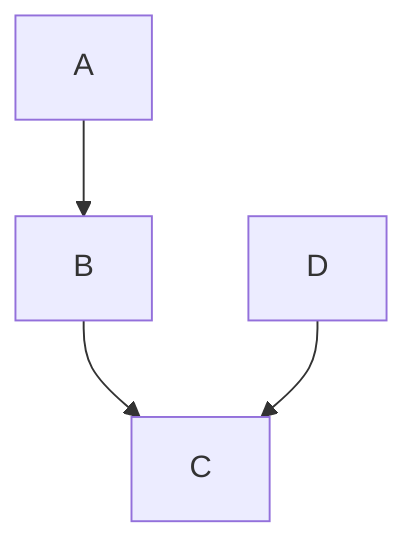

# 표준 마크다운

* \\   backslash
* \`   backtick
* \*   asterisk
* \_   underscore
* \{\}  curly braces
* \[\]  square brackets
* \(\)  parentheses
* \#   hash mark
* \+   plus sign
* \-   minus sign (hyphen)
* \.   dot
* \!   exclamation mark

##### 헤더

```markdown
This is an H1
=============

This is an H2
-------------
```

헤더 대상이 되는 텍스트 바로 아래줄로 '=' 혹은 '-' 기호를 연달아 작성하면 된다.

```markdown
# This is an H1
    
## This is an H2

###### This is an H6
```

그리고 위와 같이 '#' 기호를 1 에서 6개까지 구분하여 헤더를 작성할 수 있다.

##### 블럭 인용구

```markdown
> This is the first level of quoting.
>
> > This is nested blockquote.
>
> Back to the first level.
```

블럭 인용구는 헤더, 목록, 코드 블럭등 마크다운 문법을 다시 포함할 수 있다.

```markdown
> ## This is a header.
> 
> 1.   This is the first list item.
> 2.   This is the second list item.
> 
> Here's some example code:
> 
>     return shell_exec("echo $input | $markdown_script");
```

##### 목록

목록을 작성할 때는 '*', '+', '-' 등의 기호를 줄 단위로 맨앞에 위치시키면 된다.

```markdown
*   Red
*   Green
*   Blue
```

```markdown
+   Red
+   Green
+   Blue
```

```markdown
-   Red
-   Green
-   Blue
```

만약 숫자를 입력하는 경우에는 정렬된 숫자로 목록이 작성되게 된다.

```markdown
1.  Bird
2.  McHale
3.  Parish
```

##### 코드 블럭
    
```markdown
This is a normal paragraph:

    This is a code block.
```

코드 블럭은 기본 4개의 스페이스 혹은 1개의 탭을 입력하면 된다.

```markdown
Here is an example of AppleScript:

    tell application "Foo"
        beep
    end tell
```

##### 수평 선

문장의 혹은 페이지의 분리 표현을 위해 다음과 같은 기호로 수평 선을 표시할 수 있다.

```markdown
* * *

***

*****

- - -

---------------------------------------
```

##### 링크

'[링크 텍스트](웹_페이지_URL)' 과 같이 작성하면 링크를 나타낸다. 여기에 링크의 풍선 도움말을 위해서 
'[링크 텍스트](웹_페이지_URL "풍선도움말")' 처럼 1개의 스페이스 후 큰 따옴표에 감싸진 텍스트를 입력하면 된다.

```markdown
This is [an example](http://example.com/ "Title") inline link.
    
[This link](http://example.net/) has no title attribute.
```
    
그리고 중복되는 링크가 많은 경우 레퍼런스 타입의 링크도 있다.  '[링크 텍스트][레퍼런스 아이디]' 와 같이 입력하면 된다.

```markdown
I get 10 times more traffic from [Google][] than from
[Yahoo][] or [MSN][].

  [google]: http://google.com/        "Google"
  [yahoo]:  http://search.yahoo.com/  "Yahoo Search"
  [msn]:    http://search.msn.com/    "MSN Search"
```

##### 중요표시

중요 표시는 다음과 같이 표시한다.

```markdown
*single asterisks*

_single underscores_ (하루패드에서는 언더라인으로 사용된다.)

**double asterisks**

__double underscores__
```

##### 인라인 코드

'backquote' 혹은 'backtick' 라 불리는 '`' 기호를 사용하면 된다.

```
Use the `printf()` function.
```

Use the `printf()` function.

##### IMAGES

이미지는 링크와 그 구성이 유사하다. 링크에서 맨앞에 느낌표를 하나 추가한 구문이 링크가 된다.
'' 과 같이 작성하면 이미지 나타낸다. 여기에 이미지의 풍선 도움말을 위해서 
'' 처럼 1개의 스페이스 후 큰 따옴표에 감싸진 텍스트를 입력하면 된다.

```markdown


![Alt text][id]
[id]: /path/to/img.jpg "Optional title"
```

##### EMAIL

```markdown
Contact to <example@example.com>.
```

Contact to <example@example.com>.


# 멀티 마크다운 (GFM)

멀티 마크다운 문법은 에디터 혹은 서비스마다 지원 여부가 다를 수 있다.

> 아래의 예시 및 설명은 [Github Floverd Markdown](https://help.github.com/articles/github-flavored-markdown) 을 참조하였습니다.

##### 강제 개행

강제 개행이 필요한 문장의 끝에 두개의 스페이스를 입력하면 된다.

```markdown
Haroopad  
The next document processor
```

Haroopad  
The next document processor

##### 다중 밑줄 구문

마크다운 문법에서 '_' 는 강조 기호에 해당하지만 문서 혹은 파일명을 작성하다보면 언더바를 여러개를 한꺼번에 
사용하는 경우가 발생한다. 이런 경우 멀티 마크다운에서는 강조 기호가 아닌 일반 문장으로 인식한다.

```markdown
perform_complicated_task
do_this_and_do_that_and_another_thing
```

perform_complicated_task
do_this_and_do_that_and_another_thing

##### URL 자동링크

웹 문서를 작성하다보면 링크는 매우 자주 등장하기 마련이다. 그때마다 '[]()' 기호를 작성하지 않고 자동으로 
링크 주소를 인식해 링크 형태로 변경해준다.

##### 테이블

마크다운에서 테이블은 행과 열을 나눌 수 있고 하이픈(-)을 통해서 헤더와 바디를 구분지어 줄 수 있다. 
또한 정렬을 위해서는 콜론(:)을 이용해 아래의 예시와 같이 정렬 방향 끝에 한번만 마킹해주면 된다.

좌측 정렬   : `|:------|`
우측 정렬   : `|------:|`
가운데 정렬 : `|:-----:|`


```markdown
| name  | age | gender    | money  |
|-------|:---:|-----------|-------:|
| rhio  | 384 | robot     | $3,000 |
| haroo | .3  | bird      | $430   |
| jedi  | ?   | undefined | $0     |
```

| name  | age | gender    | money  |
|-------|:---:|-----------|-------:|
| rhio  | 384 | robot     | $3,000 |
| haroo | .3  | bird      | $430   |
| jedi  | ?   | undefined | $0     |

##### 팬스 코드블럭

일반적인 코드 블럭은 4개의 공백 혹은 1개의 탭을 입력해야 하지만 팬스 코드블럭은 처음과 끝에 'backtic' 3개로 이뤄진
구문을 작성하면 된다. 이것은 코드 블럭 라인마다 스페이스나 탭을 지정해주어야 하는 불편함을 해소해준다.

예시:

```js
function test() {
  console.log("notice the blank line before this function?");
}
```

##### 코드 구문 강조

프로그래머들은 글을 작성하다보면 코드를 예시로 드는 경우가 많다. 코드 구문 강조를 위해서 팬스 코드블럭에 구문 강조를
위한 프로그래밍 언어를 지정해주면 된다.

```ruby
require 'redcarpet'
markdown = Redcarpet.new("Hello World!")
puts markdown.to_html
```

##### 문서의 목차

`[TOC]` 는 문서의 `Table of contents` 의 약어로 문서의 구조적인 개요를 문서에 포함할 수 있도록 하는 커뮤니티 표준입니다. 특히 이 문법은 위키 문법에서 따왔다.

문서의 목차를 추가하고 싶은 위치에 `[TOC]` 를 입력하면 문서 전체의 목차를 표시할 수 있다.

```
[TOC]

# 헤더 1
내용 1

## 헤더 2
내용 2
```

`[TOC]` 는 대소문자를 구분하지 않기 때문에 `[toc]` 라고 입력해도 된다. 

그리고 유의할 사항은 `[TOC]`는 블럭 요소이기 때문에 앞뒤에 문자열이 추가되면 안된다.

**이 문서의 목차**

[TOC]

## Extras (only haroopad)

> v0.6.0 부터 실험적으로 제공된다.

##### 하이라이트

**하이라이트** 는 구문 강조 이외에 일반적인 문서에서 강조하고 싶은 문장이나 단어에 사용한다.

```markdown
Syntax ==highlighting==, **display of text** in different colors and/or fonts, depending upon its meaning in context (e.g. different parts of speech in a sentence, or ==function==  vs. ==variables names== in computer source code)
```

Syntax ==highlighting==, **display of text** in different colors and/or fonts, depending upon its meaning in context (e.g. different parts of speech in a sentence, or ==function== vs. ==variables names== in computer source code)

##### Underline

표준 마크다운에는 밑줄에 대해서는 정의하지 않지만 문서 작성 시 밑줄은 자주 사용된다. 하루패드에서는 더하기 두개(++)를 밑줄로 사용한다. 이것은 멀티 마크다운에서 정의한 것과도 동일합니다.

```markdown
An ++underline++, also called an underscore is one or more horizontal lines immediately below a portion of writing.
```

An ++underline++, also called an underscore is one or more ++horizontal lines++ immediately below a portion of writing.

##### Embedding

웹 문서를 작성하다 보면 비디오, 음악을 포함한 다양한 온라인 콘텐츠를 이용하기 마련이다.  이에 경량의 문법을 이용하는 마크다운의 특성을 유지하고 기존의 마크다운 사용자 경험에 크게 벗어나지 않으며 강력한 웹 콘텐츠를 문서내에 쉽게 추가할 수 있도록 새로운 문법을 추가하였다.

```markdown
@[하루패드 비메오 동영상](https://vimeo.com/70762354 'float:left;width:400px')

**하루패드**는 웹 친화적인 문서를 작성하기 위한 마크다운 에디터입니다. 

여러분은 간단한 마크다운 문법을 이용해 웹 문서를 생성하거나 블로그, 이메일 그리고 복잡한 리포트 문서를 작성할 수 있습니다. 

그리고 하루패드는 윈도우, 리눅스, 맥을 지원하여 여러분이 원하는 플랫폼에서 똑같은 문서 편집 경험을 얻을 수 있습니다.


```

@[하루패드 비메오 동영상](https://vimeo.com/70762354 'float:left;width:500px;height:300px;margin-right:10px')

**하루패드**는 웹 친화적인 문서를 작성하기 위한 마크다운 에디터입니다. 

여러분은 간단한 마크다운 문법을 이용해 웹 문서를 생성하거나 블로그, 이메일 그리고 복잡한 리포트 문서를 작성할 수 있습니다. 

그리고 하루패드는 윈도우, 리눅스, 맥을 지원하여 여러분이 원하는 플랫폼에서 똑같은 문서 편집 경험을 얻을 수 있습니다.


##### 수학 표기법(Mathematics Expression)

하루패드에서 수학 표현식은 MathJax 를 기반으로 LaTeX 구문을 렌더링합니다. 달러 사인 `$` 을 이용해 구문의 블럭을 지정해주면 됩니다.

방식은 2가지 방식을 지원합니다. 인라인 `$$$..$$$` 과 블럭 `$$..$$` 방식입니다.

**사용예시**

```
이것은 x의 제곱을 나타내는 $$$x^2$$$ 인라인 방식의 표현법입니다.
```

**결과**

이것은 x의 제곱을 나타내는 $$$x^2$$$ 인라인 방식의 표현법입니다.

다음은 블럭 방식입니다.

**사용예시**

```
$$
\Gamma(z) = \int_0^\infty t^{z-1}e^{-t}dt\,.
$$
```

**결과**

$$
\Gamma(z) = \int_0^\infty t^{z-1}e^{-t}dt\,.
$$

##### 다이어그램 (Diagram)

이 구문은 펜스 코드 블럭의 확장으로 플로우 차트와 다이어그램을 렌더링할 수 있도록 지원합니다.
아래의 예시와 같이 펜스 코드블럭내에 `mermaid` 문법을 입력하면 됩니다.

`mermaid` 가 지원하는 문법을 자세히 보시려면 [여기](https://github.com/knsv/mermaid/wiki)를 클릭하세요.

**example**

~~~markdown

~~~

**become**


##### 타스크 리스트 (Tasklist)

GFM 구문중에 하나로 체크 박스 항목을 표현할 수 있도록 하였다.
이 구문은 할일 혹은 체크리스트를 작성할 때 유용하다.

**example**

```markdown
- [ ] first task
- [x] second task is done
- [ ] third task
```

- [ ] first task
- [x] second task is done
- [ ] third task

##### 프리젠테이션 (Presentation)

프리젠테이션을 위한 구문은 특별히 존재하는 것은 아니고 슬라이드와 슬라이드를 구분하기 위해 `***`, `---` 를 사용해 구분자를 넣어주면 된다.

**example**

```markdown
## slide1 title

slide2 content

***

## slide2 title

slide2 content

```