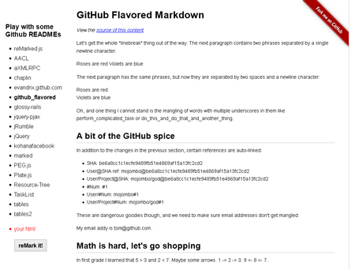

reMarked.js
-----------
client-side HTML > markdown _(MIT Licensed)_

---
### Intro

A project similar to [Markdownify](http://milianw.de/projects/markdownify/) but executed on the client. The ultimate goal is integration with existing WYSIWYG html editors (eg: Redactor, TinyMCE, CKeditor, Loki, CLeditor) to produce Markdown output. There are currently no WYSIWYG editors for markdown, only WYSIWYM, which still require knowledge of markdown syntax and its many quirky flavors.

---
### Demo: http://leeoniya.github.io/reMarked.js/



---
### Usage

```js
// optional options w/defaults
var options = {
    link_list:  false,    // render links as references, create link list as appendix
    h1_setext:  true,     // underline h1 headers
    h2_setext:  true,     // underline h2 headers
    h_atx_suf:  false,    // header suffixes (###)
    gfm_code:   "```",    // gfm code blocks
    trim_code:	true,     // trim whitespace within <pre><code> blocks (full block, not per line)
    li_bullet:  "*",      // list item bullet style
    hr_char:    "-",      // hr style
    indnt_str:  "    ",   // indentation string
    bold_char:  "*",      // char used for strong
    emph_char:  "_",      // char used for em
    gfm_del:    true,     // ~~strikeout~~ for <del>strikeout</del>
    gfm_tbls:   true,     // markdown-extra tables
    tbl_edges:  false,    // show side edges on tables
    hash_lnks:  false,    // anchors w/hash hrefs as links
    br_only:    false,    // avoid using "  " as line break indicator
    col_pre:    "col ",   // column prefix to use when creating missing headers for tables
    nbsp_spc:   false,    // convert &nbsp; entities in html to regular spaces
    span_tags:  true,     // output spans (ambiguous) using html tags
    div_tags:   true,     // output divs (ambiguous) using html tags
    unsup_tags: {         // handling of unsupported tags, defined in terms of desired output style. if not listed, output = outerHTML
        // no output
        ignore: "script style noscript",
        // eg: "<tag>some content</tag>"
        inline: "span sup sub i u b center big",
        // eg: "\n\n<tag>\n\tsome content\n</tag>"
        block2: "div form fieldset dl header footer address article aside figure hgroup section",
        // eg: "\n<tag>some content</tag>"
        block1c: "dt dd caption legend figcaption output",
        // eg: "\n\n<tag>some content</tag>"
        block2c: "canvas audio video iframe"
    },
    tag_remap: {          // remap of variants or deprecated tags to internal classes
        "i": "em",
        "b": "strong"
    }
};


var reMarker = new reMarked(options);

var markdown = reMarker.render(document.body);
```